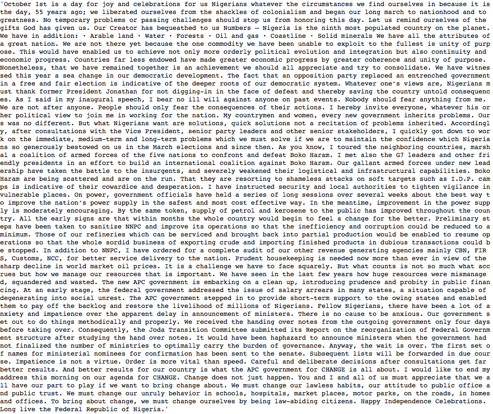

## Summarize and visualize the speeches of Presidents
This project would analyze and visualize the speeches of Nigerian President
and in the nearest future build a framework that classify a speech base on the
philosophical significance of independence

###
![Scrape the speeches and save into a csv format][1]
[1]: images/Screenshot_bubu1.png

### Can you observe any pattern?

![2015 Independence Anniversary speech][3]
[3] : images/wordcloud_speech_2015.png

![2016 Independence Anniversary speech][4]

[4] : images/wordcloud_speech_2016.png

![2017 Independence Anniversary speech][5]

[5] : images/wordcloud_speech_2017.png

![2018 Independence Anniversary speech][6]

[6] : images/wordcloud_speech_2018.png

![2019 Independence Anniversary speech][7]
[7]: images/wordcloud_speech_20191.png
